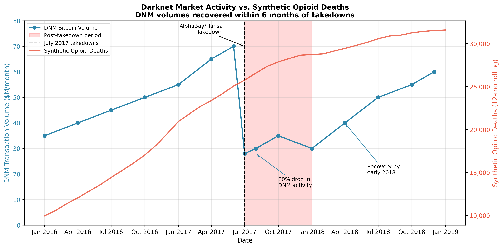

# Does shutting down dark web markets kill people? (2026)

_[Read the full paper](https://cdn.jsdelivr.net/gh/henryaj/darknet-overdose-study/paper/main.pdf)_.

In July 2017, the FBI and Europol pulled off a pretty stunning takedown of two darknet marketplaces. These marketplaces are a bit like eBay but for any illicit substance you could think of; see Gwern's post for more on them. They use Tor hidden services to evade detection - unlike normal websites, the operator's IP address is hidden by routing traffic through multiple encrypted layers.

Uncovering the owners of these websites usually requires good old-fashioned detective work - Ross Ulbricht of Silk Road fame was famously caught out when the first forum post mentioning the site turned out to be from him, and he was traced through the email address he used.

In Operation Bayonet, AlphaBay, run by a Canadian called Alexandre Cazes, was taken offline when early emails sent by the site had a reply-to address belonging to the operator of the site. But simultanously, Dutch authorities had seized a second marketplace, Hansa - and instead of taking it offline, they took control of it, updating its source code to collect data on users and their transactions. Right when AlphaBay went offline, users flocked to Hansa, playing into the hands of law enforcement.

After a few weeks, Hansa was taken offline as well. This led to a void which would eventually be filled by more marketplaces (cf. the war on drugs largely being a waste of time). My guess was that a good portion of users would simply switch to street dealers. This seems robustly bad; buying online means you get the benefit of buying from a regular seller with a brand rep to protect, and users can read reviews of the product they're buying, as well as avoiding rip-off or violent encounters with dealers.

I used Claude Code to analyse fentanyl overdoses in the months after the takedowns to see if there was a discontinuity, my hypothesis being that ODs would jump as users were pushed to buy adulterated product from local dealers.

Specifically, I looked at CDC data on overdoses from 2015-2019, using an interrupted time series analysis to check for a discontinuity in July 2017, around the time of the takedowns. I specifically focused on synthetic opioids as these are the main driver of overdose deaths.

The findings were surprising:

- Deaths actually decelerated after the takedown, which is the opposite of what I and harm reduction advocates would have predicted
- Synthetic opioid deaths grew 677 per month pre-takedown and 291 per month post-takedown, a 57% reduction in the growth rate
- Causation is murky: running "placebo tests" to check whether the same thing happened at different dates found similar decelerations in Jan 2017, Jan 2018, suggesting a broader inflection point at the time. The takedowns may have contributed or just coincided

Basically, [Betteridge's law](https://en.wikipedia.org/wiki/Betteridge%27s_law_of_headlines) applies.

## Digging deeper

The national analysis left some questions open. Could this just be a few big states driving the pattern? And did users actually get forced to street dealers, or did they just find new markets?

### State-level analysis

I extended the analysis to look at individual states. Of the 30 states with enough data, I found:

- Massive heterogeneity across states (I² = 99%, which is about as high as it gets)
- 20 states showed deceleration, but 8 states - including Tennessee, Arizona, and Washington - actually showed *acceleration* in fentanyl deaths after July 2017
- Ohio alone accounted for a huge chunk of the national pattern (-108 deaths/month), with New York and Maryland also showing big decelerations
- The national "effect" is largely driven by idiosyncratic factors in a few states, not a uniform response to the takedowns

Even more damning: running placebo tests at the state level, July 2017 was the most extreme date in only 20% of states. For most states, you'd get equally dramatic "effects" at random other dates. This suggests we're seeing general epidemic dynamics, not anything specific to the takedowns.

### Did users actually switch to street dealers?

The whole "forced to street dealers" hypothesis assumes users lost access to online markets for a meaningful period. But did they?

I looked at Chainalysis data on Bitcoin flows to darknet markets. The picture is pretty clear:

- Transaction volumes dropped ~60% immediately after the takedowns
- But they recovered within about 6 months as users migrated to Dream Market, Wall Street Market, and eventually Hydra
- By early 2018, volumes were back to pre-takedown levels

So the window during which users might have been "forced" to street dealers was brief - maybe 6 months at most. And that's assuming everyone who used darknet markets switched to street dealers rather than just... not buying drugs for a bit, or finding the new markets faster.



## Conclusions

Three independent lines of evidence point the same way:

1. National placebo tests show July 2017 isn't uniquely important
2. State-level analysis shows the pattern isn't uniform (and state placebo tests confirm July 2017 isn't special)
3. Crypto data shows markets recovered within 6 months, limiting any "forced to street" mechanism

The most boring interpretation is probably correct: the opioid epidemic hit an inflection point around 2016-2017, transitioning from explosive growth to slower (but still positive) growth. This happened to coincide with Operation Bayonet but wasn't caused by it.

This doesn't prove darknet markets provide harm reduction benefits - just that we can't detect any effect of the takedowns on overdose deaths with this data. The "whack-a-mole" problem persists: shut down one marketplace, users move to another. DrugHub seems to be the most popular one at the moment - the dark web is very much still alive.

Zambiasi (2022) found street drug crimes spiked for ~18 days after darknet shutdowns, then returned to normal (which seems unlikely to me - why 18 days? But consistent with fast market migration).

## Citation

If you use this work, please cite:

```bibtex
@misc{stanley2026darknet,
  author = {Stanley, Henry},
  title = {Does Shutting Down Dark Web Markets Kill People?},
  year = {2026},
  howpublished = {\url{https://github.com/henryaj/darknet-overdose-study}},
}
```
